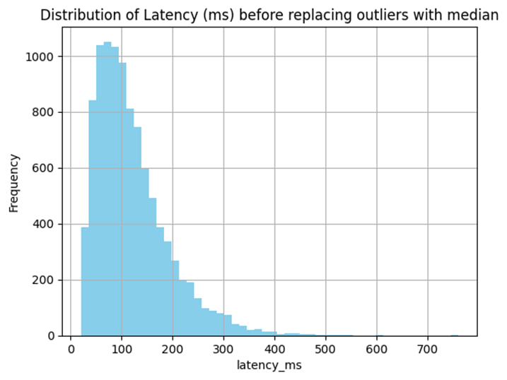
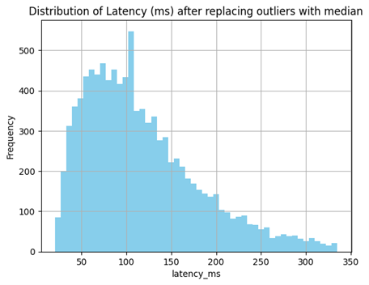
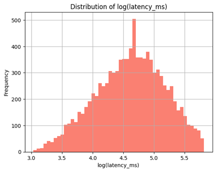
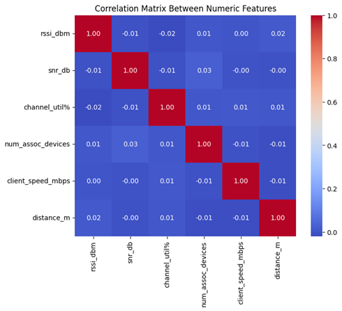
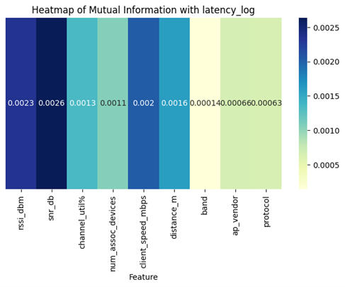
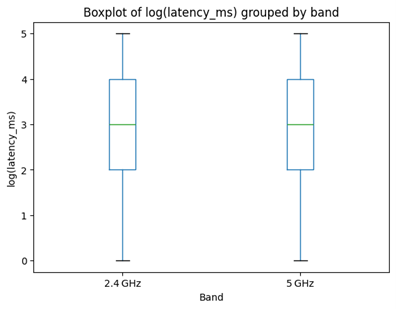

# **WiFi Signal Latency Analysis**

This project analyzes the main factors that affect Wi-Fi latency. The goal is to understand which network, signal, and environmental conditions have the strongest relationship with latency, and to rank these features using a custom Mutual Information (MI) implementation.

The work includes preprocessing, exploratory data analysis (EDA), feature engineering, visualization, and MI-based feature ranking. The whole analysis is implemented in the notebook `notebooks/wifi_latency_analysis.ipynb`.

## **Dataset**

The dataset is stored in **`data/wifi_latency.csv`**.
It was collected from the traffic of a **public Wi-Fi network**, and each row represents a **two-minute network flow**.

### **Main Features**

| Feature             | Type        | Description                                       |
| ------------------- | ----------- | ------------------------------------------------- |
| `latency_ms`        | numeric     | Network latency in milliseconds                   |
| `rssi_dbm`          | numeric     | Signal strength received by the device (dBm)      |
| `snr_db`            | numeric     | Signal-to-noise ratio                             |
| `band`              | categorical | Wi-Fi frequency band (e.g., 2.4 GHz / 5 GHz)      |
| `channel_util`      | numeric     | Channel utilization percentage                    |
| `num_assoc_devices` | numeric     | Number of devices connected to the access point   |
| `client_speed_mbps` | numeric     | Client device speed in Mbps                       |
| `ap_vendor`         | categorical | Access point vendor                               |
| `protocol`          | categorical | Wi-Fi protocol (e.g., 802.11n)                    |
| `distance_m`        | numeric     | Distance between client and access point (meters) |

The dataset includes both numerical and categorical features, which makes it suitable for studying how different factors influence Wi-Fi latency.

## **Project Structure**

```
WiFi-Signal-Latency-Analysis/
│
├── notebooks/
│   └── wifi_latency_analysis.ipynb
│
├── data/
│   └── wifi_latency.csv
│
├── results/
│   ├── correlation_heatmap.png
│   ├── mi_heatmap.png
│   ├── latency_hist_before.png
│   ├── latency_hist_after.png
│   ├── latency_log_hist.png
│   └── latency_boxplot.png
│
└── README.md
```

## **Analysis Steps**

### **1. Initial Exploration**

The first step was to explore the dataset using summary statistics, histograms, and boxplots. Early inspection showed that the `latency_ms` feature was highly skewed and contained extreme values.



### **2. Outlier Handling**

A log transformation was applied to reduce the effect of long-tailed values.
Before transforming, outliers were detected using the z-score method, and the outlier values in the latency_ms column were replaced with the column mean, which helped normalize the distribution.

Before and after transformation:





### **3. Correlation and Feature Relationships**

A correlation heatmap was used to examine how numerical variables relate to each other and to `latency_ms`.  
This helped identify features with meaningful linear relationships.



### **4. Mutual Information Ranking**

To capture non-linear relationships between features and `latency_ms`, a **custom MI function** was implemented.  
This method estimates how much information each feature contributes to predicting latency.

A heatmap summarizing the MI scores is included below:


The highest-ranked features in terms of MI were:

1. **SNR (snr_db)**
2. **RSSI (rssi_dbm)**
3. **Client speed (client_speed_mbps)**

### **5. Comparison Across Frequency Bands**

A boxplot was used to compare latency (after log transformation) between 2.4 GHz and 5 GHz bands.



The 5 GHz band generally showed lower latency, which aligns with expected Wi-Fi performance patterns.

## **How to Reproduce the Analysis**

### **1. Clone the repository**

```bash
git clone git@github.com:thisisehyas/WiFi-Signal-Latency-Analysis.git
cd WiFi-Signal-Latency-Analysis
```

### **3. Open the notebook**

You can run the notebook in Jupyter or Google Colab:

```
notebooks/wifi_latency_analysis.ipynb
```

## **Key Findings (Short Summary)**

- Wi-Fi latency is affected most strongly by **signal quality** — especially **SNR** and **RSSI**.
- Higher channel utilization and a larger number of associated devices also lead to increased latency.
- The **5 GHz band** generally provides lower latency than the 2.4 GHz band.
- Mutual Information analysis gives a clearer picture than simple correlation, because it captures **non-linear** effects.
